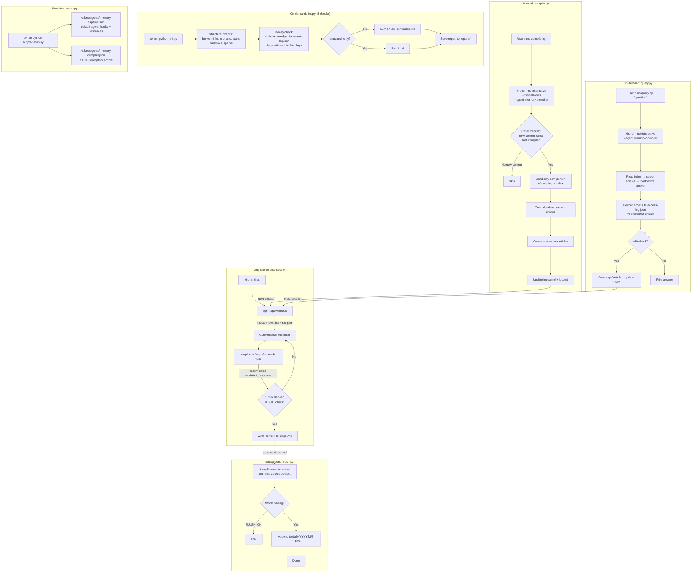

# System Flow

```mermaid
flowchart TD
    subgraph SESSION["Any kiro-cli chat session"]
        A[kiro-cli chat] --> B[agentSpawn hook]
        B -->|injects index.md + KB path| C[Conversation with user]
        C --> D[stop hook fires after each turn]
        D -->|accumulates assistant_response| E{5 min elapsed<br/>& 500+ chars?}
        E -->|No| C
        E -->|Yes| F[Write context to temp .md]
    end

    subgraph FLUSH["Background: flush.py"]
        F -->|spawns detached| G[kiro-cli --no-interactive<br/>'Summarize this context']
        G --> H{Worth saving?}
        H -->|FLUSH_OK| I[Skip]
        H -->|Yes| J[Append to daily/YYYY-MM-DD.md]
        J --> L[Done]
    end

    subgraph COMPILE["Manual: compile.py"]
        M[User runs compile.py] --> N[kiro-cli --no-interactive<br/>--trust-all-tools<br/>--agent memory-compiler]
        N --> N2{Offset tracking:<br/>new content since<br/>last compile?}
        N2 -->|No new content| N3[Skip]
        N2 -->|Yes| O[Send only new portion<br/>of daily log + index]
        O --> P[Create/update concept articles]
        P --> Q[Create connection articles]
        Q --> R[Update index.md + log.md]
    end

    subgraph QUERY["On-demand: query.py"]
        S[User runs query.py 'question'] --> T[kiro-cli --no-interactive<br/>--agent memory-compiler]
        T --> U[Read index → select articles → synthesize answer]
        U --> U2[Record access to access-log.json<br/>for consulted articles]
        U2 --> V{--file-back?}
        V -->|Yes| W[Create qa/ article + update index]
        V -->|No| X[Print answer]
    end

    subgraph LINT["On-demand: lint.py (8 checks)"]
        LA[uv run python lint.py] --> LB[Structural checks:<br/>broken links, orphans, stale,<br/>backlinks, sparse]
        LB --> LC[Decay check:<br/>stale knowledge via access-log.json<br/>flags articles idle 90+ days]
        LC --> LD{--structural-only?}
        LD -->|No| LE[LLM check: contradictions]
        LD -->|Yes| LF[Skip LLM]
        LE --> LG[Save report to reports/]
        LF --> LG
    end

    R -->|Next session| B
    W -->|Next session| B

    subgraph SETUP["One-time: setup.py"]
        Y[uv run python scripts/setup.py] --> Z[~/.kiro/agents/memory-capture.json<br/>default agent, hooks + resources]
        Y --> AA[~/.kiro/agents/memory-compiler.json<br/>full KB prompt for scripts]
    end
```
