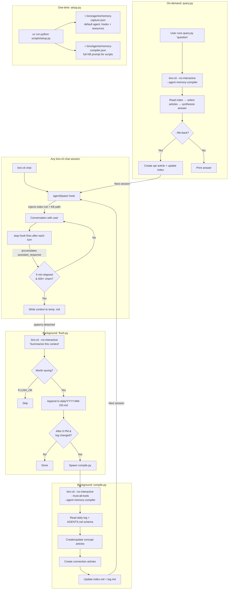

# System Flow

```mermaid
flowchart TD
    subgraph SESSION["Any kiro-cli chat session"]
        A[kiro-cli chat] --> B[agentSpawn hook]
        B -->|injects index.md + KB path| C[Conversation with user]
        C --> D[stop hook fires after each turn]
        D -->|accumulates assistant_response| E{5 min elapsed<br/>& 500+ chars?}
        E -->|No| C
        E -->|Yes| F[Write context to temp .md]
    end

    subgraph FLUSH["Background: flush.py"]
        F -->|spawns detached| G[kiro-cli --no-interactive<br/>'Summarize this context']
        G --> H{Worth saving?}
        H -->|FLUSH_OK| I[Skip]
        H -->|Yes| J[Append to daily/YYYY-MM-DD.md]
        J --> K{After 6 PM &<br/>log changed?}
        K -->|No| L[Done]
        K -->|Yes| M[Spawn compile.py]
    end

    subgraph COMPILE["Background: compile.py"]
        M --> N[kiro-cli --no-interactive<br/>--trust-all-tools<br/>--agent memory-compiler]
        N --> O[Read daily log + AGENTS.md schema]
        O --> P[Create/update concept articles]
        P --> Q[Create connection articles]
        Q --> R[Update index.md + log.md]
    end

    subgraph QUERY["On-demand: query.py"]
        S[User runs query.py 'question'] --> T[kiro-cli --no-interactive<br/>--agent memory-compiler]
        T --> U[Read index → select articles → synthesize answer]
        U --> V{--file-back?}
        V -->|Yes| W[Create qa/ article + update index]
        V -->|No| X[Print answer]
    end

    R -->|Next session| B
    W -->|Next session| B

    subgraph SETUP["One-time: setup.py"]
        Y[uv run python scripts/setup.py] --> Z[~/.kiro/agents/memory-capture.json<br/>default agent, hooks + resources]
        Y --> AA[~/.kiro/agents/memory-compiler.json<br/>full KB prompt for scripts]
    end
```
